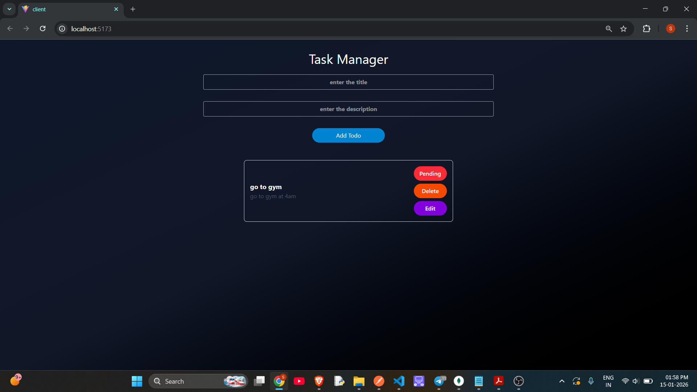
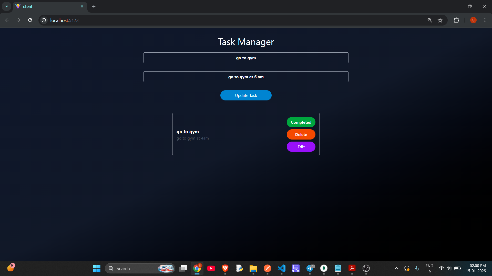

Basic Local Setup intructions

### Kindly see Screenshots and Video folder for the demo of the website

### 1) Clone the repository
```bash
git clone https://github.com/shivanisamant981/KodersAssignment.git
cd KodersAssignment

cd server
npm install

cd client
npm install

```
### 2) Add manually the .env file in backend
```bash
PORT=5000
MONGO_URI=<your_local_host_uri_OR_Cluster_uri>
```

### 3) Start frontend and backend

### Backend

```bash
nodemon index.js

```
### Frontend
```bash
npm run dev

## Screenshots

### taskadd


### Toggle Status (Pending/Completed)



